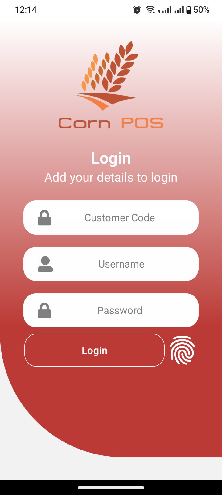
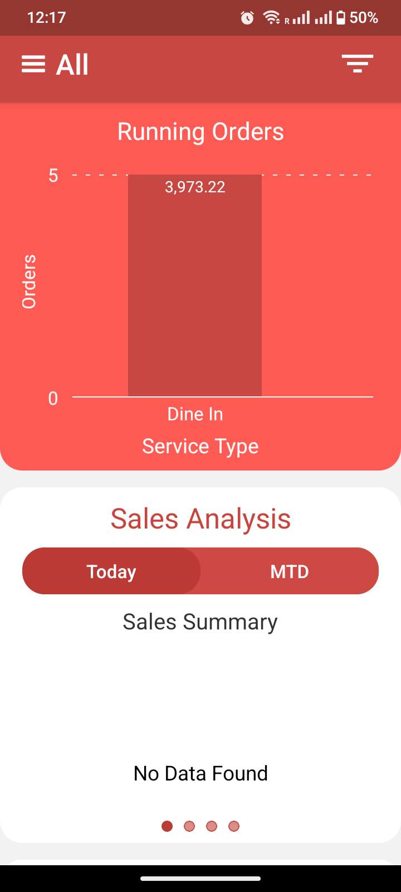
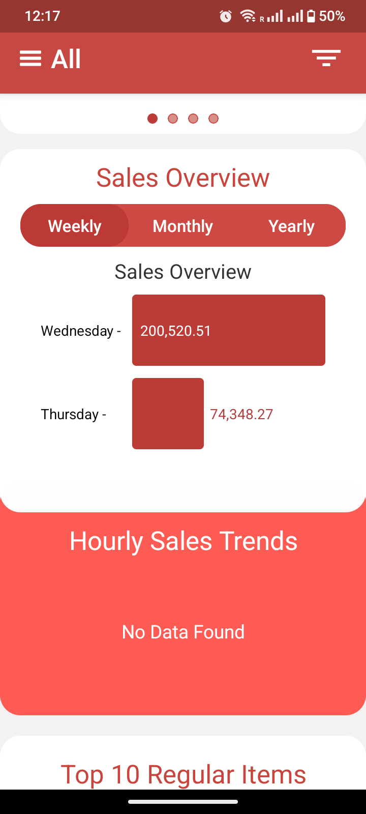
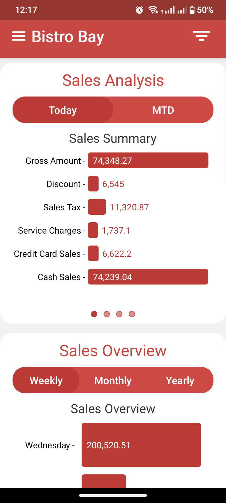
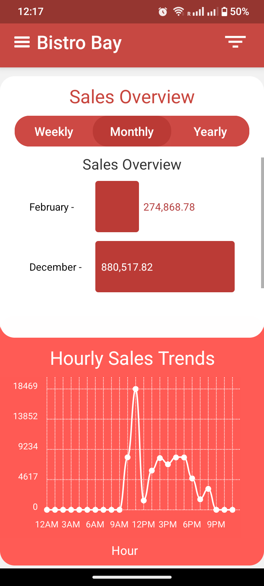
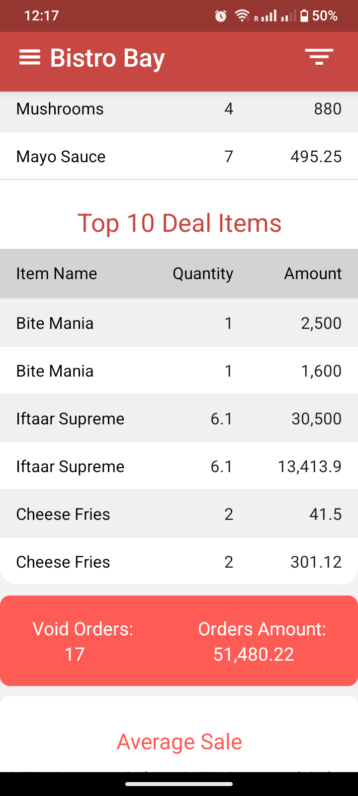
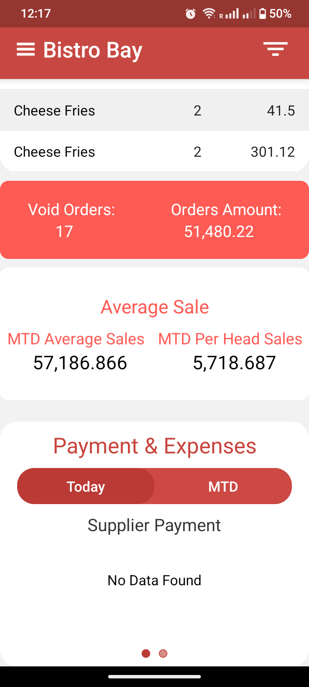

# 🚀 Project Title

This is not an OPEN source project. This application visualizes an organization’s sales data in a clear and interactive way. It is a single-screen dashboard where users can analyze their sales performance through different types of charts, including pie charts and bar charts, to gain better insights into trends and distributions.

---

## 🎥 App Recording
https://www.youtube.com/shorts/_AlO9bjFZ1c

---

## 📸 Screenshots

  
  
  
  
  
  
  

